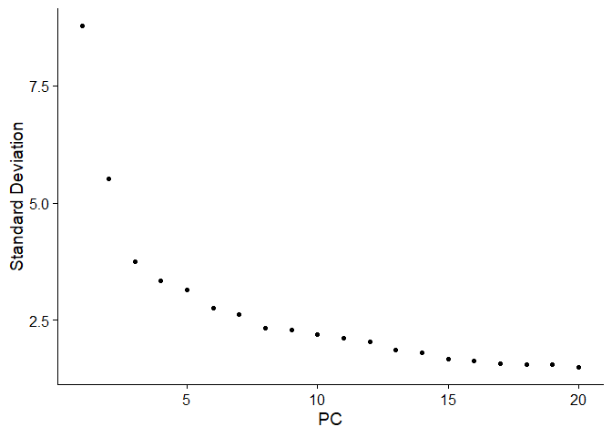
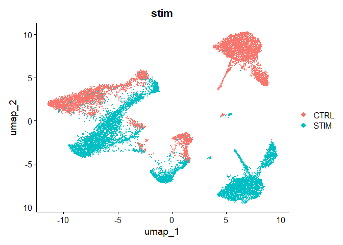
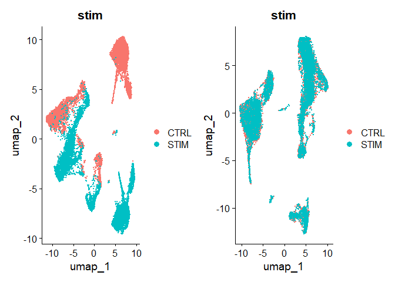
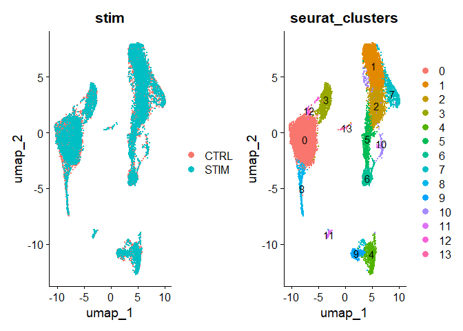
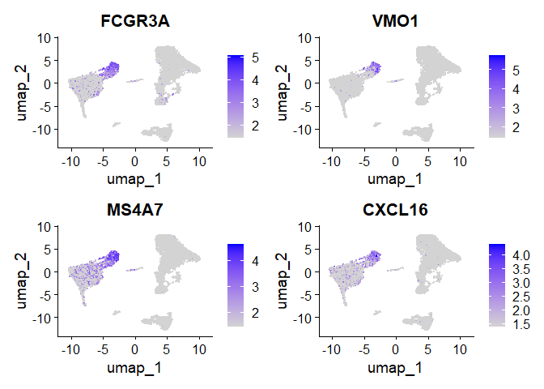
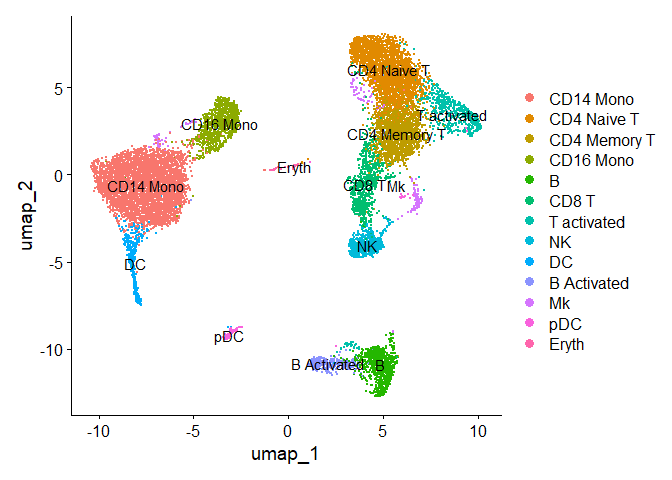
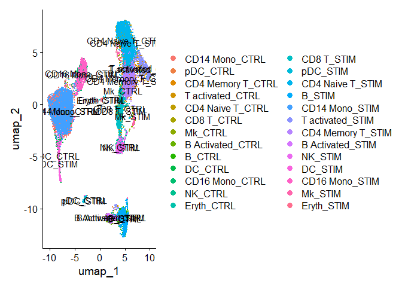
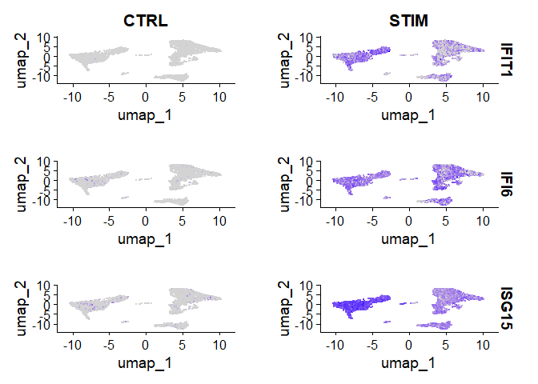
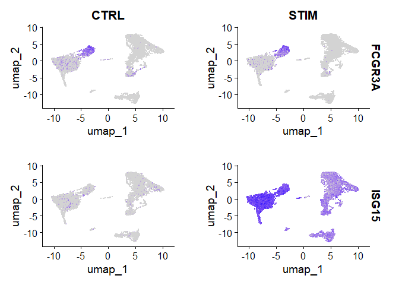
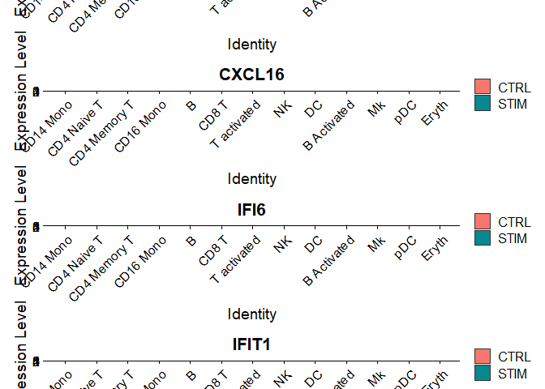

IFNb_ScRNAseq_Integrated_Analysis
================

## Objectives

### To assess cell-type-specific changes in gene expression with IFN-beta treatment

### Peripheral blood mononuclear cells (PBMCs) from eight lupus patients were split into a stimulated and control group and the stimulated group was treated with interferone beta.

### To integrate data by conditions; to overlay cells that are similar in both conditions

## Source Data and Acknowledgements

### Raw data is accessible from SeuratData Package

### Modified script from Bioinformagician: Integrate single-cell RNA-Seq data in R using Harmony | Harmony in Seurat Workflow

## Setup

``` r
pacman::p_load(tidyverse, harmony, Seurat, SeuratData, ggplot2, patchwork)


rm(list=ls())
```

## Read in data and Create Seurat Object

``` r
# install dataset
InstallData("ifnb")
```

    ## Warning: The following packages are already installed and will not be
    ## reinstalled: ifnb

``` r
# load dataset
LoadData("ifnb")
```

    ## Validating object structure

    ## Updating object slots

    ## Ensuring keys are in the proper structure

    ## Warning: Assay RNA changing from Assay to Assay

    ## Ensuring keys are in the proper structure

    ## Ensuring feature names don't have underscores or pipes

    ## Updating slots in RNA

    ## Validating object structure for Assay 'RNA'

    ## Object representation is consistent with the most current Seurat version

    ## Warning: Assay RNA changing from Assay to Assay5

``` r
str(ifnb)
```

    ## Warning: Not a validObject(): no slot of name "images" for this object of class
    ## "Seurat"

    ## Warning: Not a validObject(): no slot of name "assay.orig" for this object of
    ## class "Assay"

## Calculate % mitochondria (dying cells)

``` r
ifnb.updated = UpdateSeuratObject(object = ifnb)
```

    ## Validating object structure

    ## Updating object slots

    ## Ensuring keys are in the proper structure

    ## Warning: Assay RNA changing from Assay to Assay

    ## Ensuring keys are in the proper structure

    ## Ensuring feature names don't have underscores or pipes

    ## Updating slots in RNA

    ## Validating object structure for Assay 'RNA'

    ## Object representation is consistent with the most current Seurat version

``` r
ifnb.updated$mito.percent <- PercentageFeatureSet(ifnb.updated, pattern = '^MT-')
View(ifnb.updated@meta.data)
```

## Filtering

``` r
ifnb.updated
```

    ## An object of class Seurat 
    ## 14053 features across 13999 samples within 1 assay 
    ## Active assay: RNA (14053 features, 0 variable features)
    ##  2 layers present: counts, data

``` r
ifnb.filtered <- subset(ifnb.updated, subset = nCount_RNA > 800 &
                          nFeature_RNA > 200 & 
                          mito.percent < 5)
```

## Data Preprocessing and Visualize data before integration to correct for batch effects

``` r
# perform standard workflow steps 
ifnb.filtered <- NormalizeData(ifnb.filtered)
ifnb.filtered <- FindVariableFeatures(ifnb.filtered)
ifnb.filtered <- ScaleData(ifnb.filtered)
```

    ## Centering and scaling data matrix

``` r
ifnb.filtered <- RunPCA(ifnb.filtered)
```

    ## PC_ 1 
    ## Positive:  TYROBP, C15orf48, FCER1G, CST3, SOD2, TYMP, ANXA5, FTL, CD63, TIMP1 
    ##     CTSB, LGALS1, KYNU, FCN1, APOBEC3A, S100A4, LGALS3, PSAP, NPC2, ANXA2 
    ##     IGSF6, S100A11, LYZ, CD68, SPI1, CTSL, NINJ1, CCL2, SDCBP, HLA-DRA 
    ## Negative:  NPM1, CCR7, LTB, GIMAP7, CD7, CD2, SELL, TRAT1, IL7R, CLEC2D 
    ##     PTPRCAP, ITM2A, IL32, RHOH, RGCC, LEF1, ALOX5AP, CD3G, CREM, PASK 
    ##     MYC, SNHG8, TSC22D3, GPR171, NOP58, BIRC3, CD27, CD8B, SRM, CCL5 
    ## PC_ 2 
    ## Positive:  ISG20, ISG15, IFIT3, IFIT1, LY6E, MX1, TNFSF10, IFIT2, IFI6, RSAD2 
    ##     CXCL10, OAS1, CXCL11, MT2A, IFITM3, IRF7, OASL, IFITM2, TNFSF13B, SAMD9L 
    ##     IDO1, IL1RN, GBP1, CMPK2, DDX58, CCL8, PLSCR1, APOBEC3A, GBP4, FAM26F 
    ## Negative:  IL8, CLEC5A, CD14, VCAN, S100A8, IER3, MARCKSL1, IL1B, PID1, CD9 
    ##     GPX1, PLAUR, INSIG1, PHLDA1, PPIF, THBS1, S100A9, GAPDH, LIMS1, OSM 
    ##     SLC7A11, ACTB, GAPT, CTB-61M7.2, ENG, CEBPB, OLR1, CXCL3, FTH1, MGST1 
    ## PC_ 3 
    ## Positive:  HLA-DQA1, CD83, HLA-DQB1, CD74, HLA-DPA1, HLA-DRA, HLA-DPB1, HLA-DRB1, SYNGR2, IRF8 
    ##     CD79A, MIR155HG, HERPUD1, HLA-DMA, REL, MS4A1, FABP5, TVP23A, HSP90AB1, ID3 
    ##     CCL22, TSPAN13, EBI3, BLNK, TCF4, PRMT1, PMAIP1, NME1, HSPE1, CD70 
    ## Negative:  ANXA1, GIMAP7, CD7, CD2, RARRES3, MT2A, IL32, GNLY, PRF1, CCL2 
    ##     TRAT1, S100A9, RGCC, NKG7, CCL7, CCL5, S100A8, HPSE, CD3G, CTSL 
    ##     CCL8, ITM2A, KLRD1, GZMH, GZMA, OASL, CTSW, CD300E, GPR171, FGFBP2 
    ## PC_ 4 
    ## Positive:  CCR7, LTB, SELL, LEF1, IL7R, ADTRP, TRAT1, PASK, MYC, NPM1 
    ##     SOCS3, TSHZ2, HSP90AB1, TSC22D3, CMTM8, TARBP1, GIMAP7, SNHG8, PIM2, HSPD1 
    ##     CD3G, GBP1, TXNIP, RHOH, C12orf57, CA6, CD27, CMSS1, SESN3, BIRC3 
    ## Negative:  NKG7, GZMB, GNLY, CST7, CCL5, PRF1, CLIC3, KLRD1, GZMH, GZMA 
    ##     APOBEC3G, CTSW, FGFBP2, KLRC1, FASLG, C1orf21, HOPX, CXCR3, SH2D1B, TNFRSF18 
    ##     LINC00996, SPON2, RARRES3, SH2D2A, GCHFR, IGFBP7, ID2, C12orf75, XCL2, S1PR5 
    ## PC_ 5 
    ## Positive:  CCL2, CCL7, CCL8, PLA2G7, LMNA, TXN, S100A9, SDS, CSTB, EMP1 
    ##     CCR1, CAPG, IDO1, MGST1, CCR5, SLC7A11, HSPA1A, LILRB4, VIM, CTSB 
    ##     GCLM, HPSE, FABP5, PDE4DIP, RSAD2, LYZ, CCNA1, CTSL, SGTB, S100A8 
    ## Negative:  VMO1, FCGR3A, MS4A4A, MS4A7, CXCL16, PPM1N, HN1, LST1, SMPDL3A, CDKN1C 
    ##     CASP5, ATP1B3, CH25H, PLAC8, AIF1, SERPINA1, LRRC25, GBP5, CD86, HCAR3 
    ##     RGS19, RP11-290F20.3, VNN2, COTL1, LILRA5, C3AR1, STXBP2, ADA, PILRA, FCGR3B

``` r
ElbowPlot(ifnb.filtered)
```

<!-- -->

``` r
ifnb.filtered <- RunUMAP(ifnb.filtered, dims = 1:20, reduction = 'pca')
```

    ## 17:41:16 UMAP embedding parameters a = 0.9922 b = 1.112

    ## 17:41:16 Read 13988 rows and found 20 numeric columns

    ## 17:41:16 Using Annoy for neighbor search, n_neighbors = 30

    ## 17:41:16 Building Annoy index with metric = cosine, n_trees = 50

    ## 0%   10   20   30   40   50   60   70   80   90   100%

    ## [----|----|----|----|----|----|----|----|----|----|

    ## **************************************************|
    ## 17:41:17 Writing NN index file to temp file C:\Users\Vincent\AppData\Local\Temp\RtmpAvbvm1\file53ec5c215d8c
    ## 17:41:17 Searching Annoy index using 1 thread, search_k = 3000
    ## 17:41:20 Annoy recall = 100%
    ## 17:41:20 Commencing smooth kNN distance calibration using 1 thread with target n_neighbors = 30
    ## 17:41:21 Initializing from normalized Laplacian + noise (using RSpectra)
    ## 17:41:21 Commencing optimization for 200 epochs, with 601472 positive edges
    ## 17:41:32 Optimization finished

``` r
before <- DimPlot(ifnb.filtered, reduction = 'umap', group.by = 'stim')
before
```

<!-- -->

## Run Harmony and Get Harmony Embeddings

``` r
ifnb.harmony <- ifnb.filtered %>%
  RunHarmony(group.by.vars = 'stim', plot_convergence = FALSE)
```

    ## Transposing data matrix

    ## Initializing state using k-means centroids initialization

    ## Harmony 1/10

    ## Harmony 2/10

    ## Harmony 3/10

    ## Harmony 4/10

    ## Harmony 5/10

    ## Harmony converged after 5 iterations

``` r
ifnb.harmony@reductions

ifnb.harmony.embed <- Embeddings(ifnb.harmony, "harmony")
ifnb.harmony.embed[1:10,1:10]
```

## Scale data, Run UMAP to integrate the data

``` r
ifnb.harmony <- ifnb.harmony %>%
  RunUMAP(reduction = 'harmony', dims = 1:20) %>%
  FindNeighbors(reduction = "harmony", dims = 1:20) %>%
  FindClusters(resolution = 0.5)
```

    ## 17:41:46 UMAP embedding parameters a = 0.9922 b = 1.112

    ## 17:41:46 Read 13988 rows and found 20 numeric columns

    ## 17:41:46 Using Annoy for neighbor search, n_neighbors = 30

    ## 17:41:46 Building Annoy index with metric = cosine, n_trees = 50

    ## 0%   10   20   30   40   50   60   70   80   90   100%

    ## [----|----|----|----|----|----|----|----|----|----|

    ## **************************************************|
    ## 17:41:47 Writing NN index file to temp file C:\Users\Vincent\AppData\Local\Temp\RtmpAvbvm1\file53ec74ab49a1
    ## 17:41:47 Searching Annoy index using 1 thread, search_k = 3000
    ## 17:41:50 Annoy recall = 100%
    ## 17:41:51 Commencing smooth kNN distance calibration using 1 thread with target n_neighbors = 30
    ## 17:41:51 Initializing from normalized Laplacian + noise (using RSpectra)
    ## 17:41:52 Commencing optimization for 200 epochs, with 606280 positive edges
    ## 17:42:03 Optimization finished
    ## Computing nearest neighbor graph
    ## Computing SNN

## Visualize integrated data

``` r
# visualize 
after <- DimPlot(ifnb.harmony, reduction = 'umap', group.by = 'stim')

before|after
```

<!-- -->

## Save harmony Object

``` r
saveRDS(ifnb.harmony, file = "./results/ifnb_harmony.rds")
```

## Visualize the data

``` r
# visualize data
clusters <- DimPlot(ifnb.harmony, reduction = 'umap', group.by = 'seurat_clusters', label = TRUE)
condition <- DimPlot(ifnb.harmony, reduction = 'umap', group.by = 'stim')
condition|clusters
```

<!-- -->

## FindConserved markers

``` r
# Notes:
# slot depends on the type of the test used, 
# default is data slot that stores normalized data
# DefaultAssay(ifnb_harmony) <- 'RNA'

DefaultAssay(ifnb.harmony) <- 'RNA'

markers_cluster3 <- FindConservedMarkers(ifnb.harmony,
                     ident.1 = 3,
                     grouping.var = 'stim')
```

    ## Testing group CTRL: (3) vs (0, 11, 2, 7, 1, 5, 10, 9, 4, 8, 6, 12, 13)

    ## For a (much!) faster implementation of the Wilcoxon Rank Sum Test,
    ## (default method for FindMarkers) please install the presto package
    ## --------------------------------------------
    ## install.packages('devtools')
    ## devtools::install_github('immunogenomics/presto')
    ## --------------------------------------------
    ## After installation of presto, Seurat will automatically use the more 
    ## efficient implementation (no further action necessary).
    ## This message will be shown once per session

    ## Testing group STIM: (3) vs (5, 11, 1, 4, 0, 7, 2, 9, 6, 8, 10, 12, 13)

``` r
head(markers_cluster3)
```

## Visualize the top features from Cluster 3 of conserved markers

``` r
# let's visualize top features
FeaturePlot(ifnb.harmony, features = c('FCGR3A', 'VMO1', 'MS4A7', 'CXCL16'), min.cutoff = 'q10')
```

<!-- -->

``` r
# min-cut off explanation:
seq(1,5)
```

    ## [1] 1 2 3 4 5

``` r
SetQuantile('q50', seq(1,5))
```

    ## [1] 3

``` r
SetQuantile('q10', seq(1,5))
```

    ## [1] 1.4

## Annotate the different clusters

``` r
# cells already have annotations provided in the metadata
View(ifnb.harmony@meta.data)

# Settings cluster identities is an iterative step
# multiple approaches could be taken - automatic/manual anotations (sometimes both)
# need to make sure each cell type forms a separate cluster

# setting Idents as Seurat annotations provided (also a sanity check!)
Idents(ifnb.harmony) <- ifnb.harmony@meta.data$seurat_annotations
Idents(ifnb.harmony)
```

``` r
DimPlot(ifnb.harmony, reduction = 'umap', label = TRUE)
```

<!-- -->

## FindMarkers between conditions

``` r
ifnb.harmony$celltype.stim <- paste0(ifnb.harmony$seurat_annotations,'_', ifnb.harmony$stim)
ifnb.harmony$celltype <- Idents(ifnb.harmony)
Idents(ifnb.harmony) <- "celltype.stim"
View(ifnb.harmony@meta.data)
```

``` r
DimPlot(ifnb.harmony, reduction = 'umap', label = TRUE)
```

<!-- -->

## Find markers

``` r
b.interferon.response <- FindMarkers(ifnb.harmony, ident.1 = 'CD16 Mono_STIM', ident.2 = 'CD16 Mono_CTRL')

head(b.interferon.response)
```

## Differentially expressed genes (by conditions)

``` r
FeaturePlot(ifnb.harmony, features = c('IFIT1', 'IFI6', 'ISG15'), split.by = 'stim', min.cutoff = 'q10')
```

<!-- -->

## plotting conserved features vs DE features between conditions (by conditions)

``` r
head(markers_cluster3)

FeaturePlot(ifnb.harmony, features = c('FCGR3A', 'ISG15'), split.by = 'stim', min.cutoff = 'q10')
```

<!-- -->

## plotting conserved features vs DE features between conditions (by conditions and cell types)

``` r
plots <- VlnPlot(ifnb.harmony, features = c('MS4A7', 'CXCL16', 'IFI6', 'IFIT1'), split.by = "stim", group.by = "celltype", 
    pt.size = 0, combine = FALSE)
```

    ## The default behaviour of split.by has changed.
    ## Separate violin plots are now plotted side-by-side.
    ## To restore the old behaviour of a single split violin,
    ## set split.plot = TRUE.
    ##       
    ## This message will be shown once per session.

``` r
wrap_plots(plots = plots, ncol = 1)
```

<!-- -->
